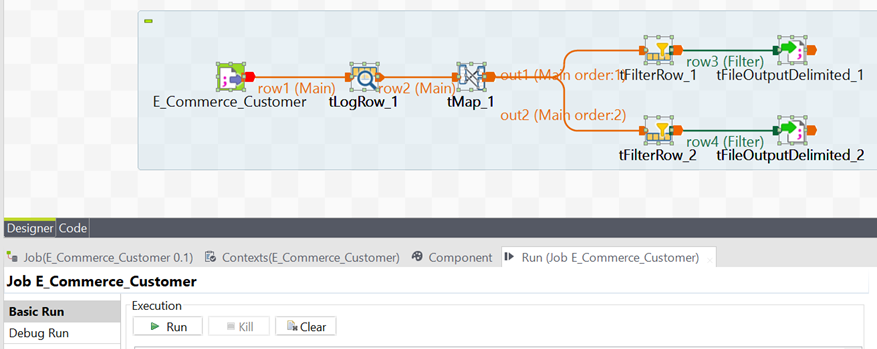

# E-Commerce Customer Dataset Analysis

## Project Overview

This case study aims to analyze the "E-Commerce Customer" dataset utilizing multiple tools, including Talend Data Integration, Talend Data Prep, and SAS Enterprise Miner. The primary objectives encompass data preprocessing, decision tree analysis, and the application of ensemble methods to predict customer churn. Each tool plays a pivotal role in distinct stages of the project. 

## Tools used
- **Talend Data Integration**: Used for initial data import and preprocessing.
- **Talend Data Prep**: Applied for deeper data cleaning and transformation to ensure high-quality data for analysis.
- **SAS Enterprise Miner**: Utilized for building data mining models such as decision trees, clustering, Bagging Random Forest, and Boosting using Random Forest.

## Data Files

The dataset used for this analysis is the "E-Commerce Customer" dataset, which records customer transactions on an e-commerce platform in 2023. The dataset can be accessed in E-Commerce Customer.csv. Link : https://github.com/S2190053/S2190053/blob/07f27d499c2efb129b7ee2228c3b5bfd47c51344/E-Commerce%20Customer.csv

The "E-Commerce Customer" dataset records customer transactions on an e-commerce platform in 2023, with 12 attributes such as Customer ID, Age, Gender, Location, Membership Level, Total Purchases, Total Spent, Favorite Category, Last Purchase Date, Occupation, Website Visits Frequency, and Churn. The dataset comprises 570 rows.

| Variable               | Data Type | Description                                          |
|------------------------|-----------|------------------------------------------------------|
| Customer ID            | Numeric   | Unique identifier for each customer                  |
| Age                    | Numeric   | Age of the customer                                  |
| Gender                 | String    | Gender of the customer                               |
| Location               | String    | State of the customer base in Malaysia               |
| Membership Level       | String    | Membership level label in Bronze, Silver, Gold, Platinum |
| Total Purchases        | Numeric   | Total number of purchases made by the customer       |
| Total Spent            | Numeric   | Total amount spent by the customer                   |
| Favorite Category      | String    | The category in which the customer most frequently shops |
| Last Purchase Date     | Date      | The date of the last purchase                        |
| Occupation             | String    | Customer's occupation                                |
| Website Visits Frequency| String   | Frequency of customer visits to the website          |
| Churn                  | Numeric   | Indicates whether the customer has stopped purchasing (1 for churned, 0 for active) |

## Documentation for Each Tool

### Talend Data Integration

1. Create a project in Talend data integration.
2. Extract data from a CSV file using Talend's File Delimited metadata.
3. Perform data preprocessing, including handling missing values and data type adjustments.
4. Use Talend components such as tLogRow and tMap for data extraction and filtering.
5. Design the overall flow and run the process.
6. After finish run the filter clean dataset will be used for analysis in next tools.

### Talend Data Prep

1. Import data into Talend Preparation for deeper preprocessing.
2. Study the data, clean attributes with wrong labels and handle missing data.
3. Change labels, remove missing data, and group similar text data.
4. Export the cleaned dataset to a CSV file.

### SAS Enterprise Miner

1. Create a new project and diagram in SAS Enterprise Miner.
2. Import data, partition it, and set up a decision tree analysis.
3. Run the decision tree model and analyze the results.
4. Apply Bagging Random Forest and Boosting using Random Forest.
5. Evaluate the models' performance on training, validation, and test datasets.

## Ensemble Method

An approach involves ensemble modeling through the creation of multiple samples with different percentages. Decision trees are then linked for analysis, and the ensemble node is used to combine the results.

Throughout the learning journey focused on customer behavior analysis, i employed Talend Integration and Talend Preprocessing for data preparation, while SAS Enterprise Miner served as a powerful tool for Decision Tree Analysis. Additionally, Ensemble Methods such as Bagging and Boosting were applied, emphasizing the Random Forest algorithm as a Bagging example.

## Result analysis

### Random Forest Model Analysis

- The Random Forest model, employing 100 trees, was trained on 222 observations, demonstrating competitive fit statistics.
- The average square error decreased with an increasing number of trees, stabilizing at 0.06170.
- Key predictors for predicting churn included "FavoriteCategory," "Age," "Occupation," and "LastPurchaseDate."
- The model's assessment score rankings showcase its efficacy across various depth levels.
- The scoring process was efficient, taking minimal time.
- The model's predictive accuracy was assessed on training, validation, and test datasets.
- Root Average Squared Errors: Training (0.248), Validation (0.286), and Test (0.355).
- Overall, the Random Forest demonstrated robust predictive performance in identifying potential churn instances.

### Customer Churn Prediction Analysis

- The analysis predicting customer churn revealed significant predictors.
- Key variables influencing the model include "LastPurchaseDate," "FavoriteCategory," "Occupation," and "Age."
- Fit Statistics show good performance on the training set, with an average squared error of 0.033.
- Assessment Score Rankings illustrate the model's ability to differentiate between churn and active customers across different depths.
- Variable Importance indicates "LastPurchaseDate" as the most influential.
- The model demonstrates promising predictive power, emphasizing the importance of recent purchase behavior and customer demographics in identifying potential churn.

### Model Ensemble Analysis

- The analyst trained a model ensemble, combining models labeled TREE2 to TREE6 using the average probability function.
- Training fit statistics indicate an average squared error (ASE) of 0.0318 and a root average squared error (RASE) of 0.1782.
- Assessment score rankings show varying prediction accuracies across different depths.
- Observations at depth 5 achieved a perfect match.
- The assessment score distribution illustrates the model's ability to differentiate between high and low predicted churn probabilities.

## Reflections or Learning Outcomes

### 1. Data Integration with Talend:
- Learned to seamlessly integrate diverse datasets using Talend Integration.
- Acquired skills in handling complex data transformations and ensuring data quality before analysis.

### 2. Talend Preprocessing:
- Gained insights into the significance of data preprocessing in enhancing model accuracy.
- Mastered techniques for handling missing data, outliers, and categorical variables efficiently using Talend.

### 3. SAS Enterprise Miner for Decision Tree Analysis:
- Developed a deep understanding of Decision Tree Analysis in SAS Enterprise Miner.
- Explored feature selection, node splitting, and pruning techniques for building an interpretable and accurate decision tree model.

### 4. Ensemble Methods - Bagging and Boosting:
- Studied the theoretical foundations of Bagging and Boosting algorithms.
- Applied the Random Forest algorithm as a Bagging example to leverage the power of multiple decision trees for improved predictive performance.

## Challenges Faced

### 1. Data Quality Challenges:
- Encountered issues related to inconsistent data formats, missing values, and outliers during data integration and preprocessing.
- Overcame challenges through meticulous data cleansing and transformation processes, leveraging Talend functionalities.

### 2. Model Complexity in SAS Enterprise Miner:
- Faced difficulties in optimizing model complexity and preventing overfitting in SAS Enterprise Miner.
- Addressed these challenges by experimenting with different hyperparameters, feature selection techniques, and pruning strategies.

### 3. Ensemble Method Implementation:
- Encountered complexities in understanding and implementing the Random Forest algorithm as a Bagging technique.
- Overcame challenges through extensive research, hands-on experimentation, and leveraging available resources and documentation.

## Strategies for Overcoming Challenges

### 1. Collaboration and Knowledge Sharing:
- Engaged in collaborative efforts with peers and experts to share insights and solutions for data quality challenges.
- Actively participated in forums, communities, and training sessions to enhance understanding and problem-solving skills.

### 2. Continuous Learning and Experimentation:
- Adopted a mindset of continuous learning and experimentation to overcome model complexity challenges.
- Explored various model configurations and hyperparameter settings in SAS Enterprise Miner to find the optimal balance between accuracy and simplicity.

### 3. Documentation and Knowledge Transfer:
- Documented challenges, solutions, and key learnings for future reference and knowledge transfer.
- Utilized comprehensive documentation and training materials provided by Talend and SAS to enhance proficiency in using these tools.

## Conclusion
In conclusion, the integration of Talend, Talend Preprocessing, and SAS Enterprise Miner, coupled with the application of Ensemble Methods, provided a holistic approach to customer behavior analysis. The journey was marked by valuable learnings, persistent challenges, and effective strategies to overcome them, ultimately contributing to the successful creation of a decision tree model for insightful analysis of customer behavior.

